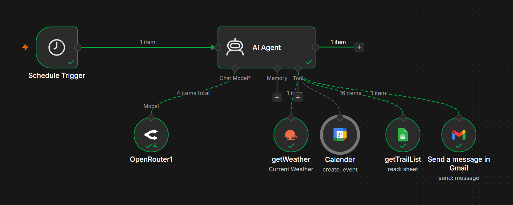

# Weather-Aware Hiking Agent

An AI-powered hiking recommendation agent built with **n8n** that leverages **real-time weather data**, **trail information**, and an **LLM** to generate personalized hiking recommendations via email.

---

## Overview

This project automates hiking recommendations by combining real-time weather conditions with trail information. The AI agent analyzes the current weather, evaluates suitable hiking trails, and sends personalized recommendations directly to the user's email.

---

## Features

- Real-time weather analysis using **OpenWeatherMap**
- AI-powered hiking recommendations using an **LLM**
- Trail data retrieval from **Google Sheets**
- Calendar-aware reporting via **Google Calendar** (checks for upcoming scheduled hikes)
- Automated email delivery through **Gmail**
- End-to-end workflow orchestration with **n8n**

---

## Tech Stack

- **n8n**
- **OpenRouter (LLM)**
- **OpenWeatherMap API**
- **Google Sheets API**
- **Google Calendar API**
- **Gmail API**
- **OAuth 2.0**

---

## Workflow

<p align="center">
  
</p>

---

## How It Works

1. The workflow is triggered on a schedule.
2. The AI agent retrieves real-time weather data from OpenWeatherMap.
3. Trail information is fetched from Google Sheets.
4. The agent checks Google Calendar for any hikes scheduled in the next few days.
5. The LLM analyzes the weather and trail data.
6. Personalized hiking recommendations are generated.
7. The recommendations are emailed to the user.

---

## Repository Structure

```text
weather-aware-hiking-agent/
│
├── workflow.json
├── README.md
├── LICENSE
└── assets/
    └── workflow_image.png
```

---

## Setup

1. Import `workflow.json` into n8n.
2. Configure the following credentials:
   - OpenRouter
   - OpenWeatherMap
   - Google Sheets
   - Google Calendar
   - Gmail
3. Replace `your-email@gmail.com` in the workflow with your own Google email address.
4. Execute the workflow.

---

## Future Improvements

- Support multiple hiking locations
- Integrate live air quality and rainfall forecasts
- Add terrain difficulty and elevation analysis
- Integrate interactive trail maps
- Send notifications via Telegram or WhatsApp

---

## License

This project is licensed under the **MIT License**.
